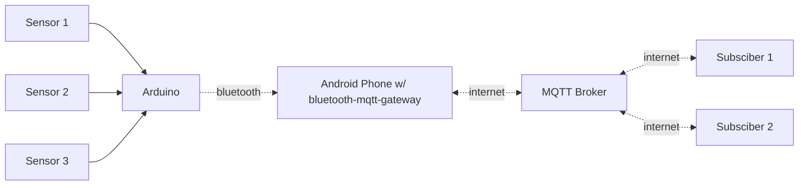

# bluetooth-mqtt-gateway

This app is a modified version of [SimpleBluetoothTerminal](https://github.com/kai-morich/SimpleBluetoothTerminal), where I added the ability for the app to publish the Bluetooth message to an MQTT broker. This is part of a project that I'm working on where I need to receive data from Arduino and push them to an MQTT broker, and the rest of the system will handle that data.

Here's where it sits in my system:

